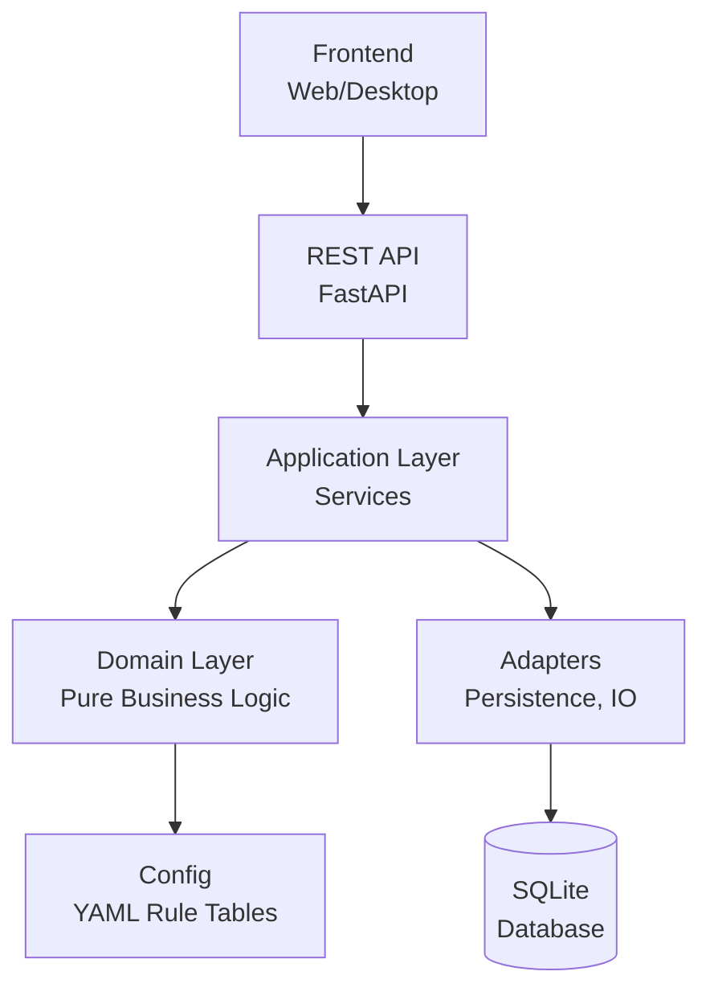

# WH40k Colony Manager

**A Python engine for organizing and tracking a Warhammer 40k Rogue Trader Colony**

[](LICENSE)
[](https://www.python.org/downloads/)
[](TESTING_TODO.md)
[](https://github.com/astral-sh/ruff)
[](https://mypy-lang.org/)

---

## Table of Contents

- [Overview](#overview)
- [Features](#features)
- [Quick Start](#quick-start)
- [Architecture](#architecture)
- [API Usage](#api-usage)
- [Documentation](#documentation)
- [Development](#development)
- [Contributing](#contributing)
- [License](#license)

---

## Overview

The **WH40k Colony Manager** is a comprehensive Python engine designed to replace manually-maintained spreadsheets for tracking Warhammer 40k Rogue Trader colonies. It provides:

- **Core colony stats**: Size, Complacency, Order, Productivity, Piety, and derived Profit Factor
- **Infrastructure management**: Hard Infrastructure and Support Upgrades with conditional bonuses
- **Representative system**: RPG stats/skills/talents that modify colony behavior
- **State transitions**: Threshold-based events (Anarchy, Placated, Productive, etc.)
- **Modifier tracking**: Record GM-created modifiers, dice roll results, and event effects

The engine is designed for consumption by multiple frontends: REST API, web UI, and (future) desktop app.

---

## Features

### 🎯 Core Features

- **Colony Management**: Track all colony stats with automatic calculations
- **Infrastructure System**: Manage working/faulty infrastructure with stacking bonuses
- **Support Upgrades**: Limited by colony size, with custom stat choices
- **Representatives**: Assign Judges, Cardinals, or Satraps with unique personalities
- **Events & Development**: GM-created events and long-term development plans
- **Multi-User Support**: Role-based access control (Owner, Admin, Editor, Viewer)
- **Export/Import**: Portable colony files for backup and sharing
- **Audit Logging**: Complete change history for all colony modifications

### 🛡️ Technical Features

- **Clean Architecture**: Domain logic isolated from I/O and frameworks
- **Type-Safe**: Full type hints with mypy validation
- **Tested**: 695+ passing tests with property-based testing
- **RESTful API**: FastAPI-based REST API with OpenAPI documentation
- **Real-time Updates**: Server-Sent Events for live notifications
- **Security**: JWT authentication, rate limiting, password validation

### ⚠️ Scope Clarification

**This application is a tracking and organization tool, NOT a game automation system.**

What the application does:

- ✅ Track colony stats and calculate derived values
- ✅ Store infrastructure, upgrades, and their states
- ✅ Record modifiers created by the GM
- ✅ Maintain audit logs and history
- ✅ Provide API access for frontends

What the application does NOT do:

- ❌ Automate dice rolls (GM enters results manually)
- ❌ Run automatic event cycles or time-based mechanics
- ❌ Make gameplay decisions or resolve game mechanics
- ❌ Replace the GM during gameplay

All game mechanics happen at the table during the actual play session. The GM
manually enters results, modifiers, and outcomes into the system.

---
---

## Quick Start

### Prerequisites

- Python 3.12 or higher
- uv package manager (recommended) or pip

### Installation

```bash
# Clone the repository
git clone https://github.com/yourusername/WH40k_Colony_Manager.git
cd WH40k_Colony_Manager

# Install dependencies
uv sync --extra dev

# Run the API server
uv run uvicorn colony_manager.main:app --reload

# Access the API documentation
# Open http://localhost:8000/docs in your browser
```

### First Steps

1. **Register a user**: `POST /api/v1/auth/register`
2. **Login**: `POST /api/v1/auth/login`
3. **Create a colony**: `POST /api/v1/colonies`
4. **Add infrastructure**: `POST /api/v1/colonies/{id}/infrastructure`
5. **Assign a representative**: `POST /api/v1/representatives/{id}/assign`

See the [API Reference](docs/api_reference.md) for detailed examples.

---

## Architecture

### System Overview



### Layered Architecture

```
src/colony_manager/
├── domain/              # Pure business logic, zero I/O
│   ├── models/          # Colony, Representative, Infrastructure, etc.
│   ├── rules/           # Calculation rules (stateless functions)
│   └── ports/           # Repository interfaces (Protocol/ABC)
│
├── application/         # Use cases / services
│   └── services/        # Orchestrates domain + ports
│
├── adapters/            # External world implementations
│   ├── persistence/     # SQLite repository implementations
│   ├── io/              # JSON/YAML import & export
│   ├── api/             # FastAPI routers, schemas
│   └── cli/             # Typer command-line entry points
│
└── config/              # Rule-table data (YAML)
    ├── colony_types.yaml
    ├── rule_tables.yaml
    └── personalities.yaml
```

### Key Design Principles

1. **Domain logic has zero I/O** — No FastAPI, SQLAlchemy, or file-system access in domain code
2. **Game rule data is data, not code** — Numeric tables in YAML config files
3. **Don't abstract preemptively** — Only introduce abstractions when used in ≥2 places
4. **Dependencies point inward** — `adapters → application → domain`

See [Architecture Documentation](docs/architecture.md) for details.

---

## API Usage

### Authentication Example

```bash
# Register
curl -X POST http://localhost:8000/api/v1/auth/register \
  -H "Content-Type: application/json" \
  -d '{"username": "commander", "email": "cmdr@example.com", "password": "SecureP@ssw0rd!"}'

# Login
curl -X POST http://localhost:8000/api/v1/auth/login \
  -H "Content-Type: application/json" \
  -d '{"username": "commander", "password": "SecureP@ssw0rd!"}'
```

### Create Colony Example

```bash
curl -X POST http://localhost:8000/api/v1/colonies \
  -H "Content-Type: application/json" \
  -H "Authorization: Bearer YOUR_TOKEN" \
  -d '{"name": "New Terra", "colony_type": "forge_world", "base_size": 5}'
```

### API Documentation

Interactive API documentation is available at:

- **Swagger UI**: <http://localhost:8000/docs>
- **ReDoc**: <http://localhost:8000/redoc>

Complete API reference: [API Reference](docs/api_reference.md)

---

## Documentation

### Core Documentation

| Document | Description |
|----------|-------------|
| [Business Analysis](docs/business_analysis.md) | Domain rules and game mechanics (single source of truth) |
| [Architecture](docs/architecture.md) | System architecture and design decisions |
| [API Reference](docs/api_reference.md) | Complete API reference with examples |
| [UI Design System](docs/UI_DESIGN_SYSTEM.md) | Frontend design system and component library |
| [Frontend Requirements](docs/FRONTEND_REQUIREMENTS.md) | Frontend integration guide |

### Deployment & Operations

| Document | Description |
|----------|-------------|
| [Deployment Checklist](docs/DEPLOYMENT_CHECKLIST.md) | Step-by-step deployment guide |
| [Deployment Status](docs/DEPLOYMENT_STATUS.md) | Current deployment readiness |
| [Security Configuration](docs/SECURITY_CONFIGURATION.md) | Security hardening guide |
| [Configuration](docs/configuration.md) | Environment and app configuration |
| [Troubleshooting](docs/troubleshooting.md) | Common issues and solutions |

### Project Management

| Document | Description |
|----------|-------------|
| [Roadmap](docs/ROADMAP.md) | Project roadmap and future phases |
| [Testing TODO](TESTING_TODO.md) | Test coverage and strategy |
| [API TODO](API_TODO.md) | API development tracking |
| [Scope Clarifications](docs/SCOPE_CLARIFICATIONS.md) | Important scope boundaries |
| [Quality Report](docs/SONARQUBE_REPORT.md) | Code quality metrics |

### Archived Documents

Historical documents moved to [`docs/archive/`](docs/archive/):

- UI Visualization Prompt (external mockup reference)
- Agent Briefing (AI onboarding — see `.clinerules/` for current guidelines)
- UI Panel Requirements (superseded by UI_DESIGN_SYSTEM.md)

---

## Development

### Running Tests

```bash
# Run all tests
uv run pytest -q

# Run with coverage
uv run pytest --cov=colony_manager

# Run specific test file
uv run pytest tests/domain/test_colony.py -v
```

### Code Quality

```bash
# Format code
uv run ruff format .

# Lint code
uv run ruff check .

# Type checking
uv run mypy src/colony_manager
```

### Project Layout

See the [Architecture](#architecture) section above for the complete project structure.

---

## Contributing

We welcome contributions! Please follow these steps:

### 1. Fork and Clone

```bash
git clone https://github.com/yourusername/WH40k_Colony_Manager.git
cd WH40k_Colony_Manager
```

### 2. Set Up Development Environment

```bash
uv sync --extra dev
```

### 3. Create a Branch

```bash
git checkout -b feature/your-feature-name
```

### 4. Make Changes

- Follow the existing code style (Google-style docstrings, full type hints)
- Add tests for new functionality
- Update documentation as needed

### 5. Run Tests and Linters

```bash
uv run pytest -q
uv run ruff check .
uv run mypy src/colony_manager
```

### 6. Submit a Pull Request

Push your changes and open a PR on GitHub. Include:

- Description of changes
- Link to any related issues
- Test coverage details

### Code Style

- **Type Hints**: Full type hints on all public functions
- **Docstrings**: Google-style for all public modules/classes/functions
- **Formatting**: ruff (black-compatible)
- **Linting**: ruff with project-specific rules

See [CONTRIBUTING.md](CONTRIBUTING.md) for detailed guidelines.

---

## License

This project is licensed under the MIT License - see the [LICENSE](LICENSE) file for details.

---

## Support

For issues, questions, or feature requests, please:

1. Check existing [documentation](docs/)
2. Search existing [GitHub issues](https://github.com/yourusername/WH40k_Colony_Manager/issues)
3. Open a new issue with detailed description

---

**The Emperor Protects** 🦅
