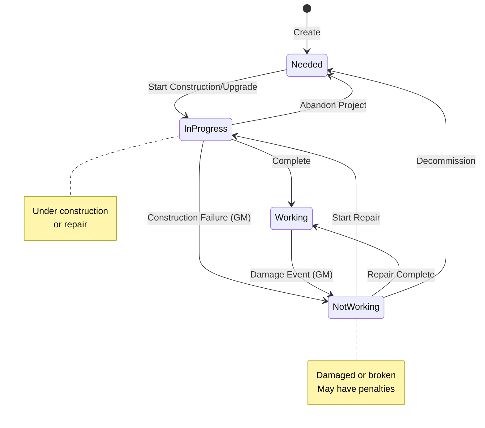

# Infrastructure Status Transition Rules

**Date:** 2026-08-29  
**Status:** Proposal for GM/Player Decision  
**Priority:** High (Blocks UI workflow implementation)

---

## Overview

This document proposes rules for transitioning Hard Infrastructure and Support Upgrades between their four possible statuses. The rules reference defines what each status *does*, but not which transitions are allowed or what triggers them.

**Current Statuses:**

- `Working` — Fully operational, providing full bonus
- `Not Working` — Damaged/broken, providing no bonus (may cause penalties)
- `In Progress` — Under construction/repair, not yet functional
- `Needed` — Planned but not yet started

**State Transition Diagram:**

---

## Design Principles

1. **GM Authority** — The GM should always be able to override transitions for narrative reasons
2. **Realistic Progression** — Construction and repair should follow logical sequences
3. **Game Flow** — Transitions should support the 90-day development cycle without unnecessary friction
4. **Transparency** — Players should understand why a transition is or isn't allowed

---

## Proposed Transition Matrix

### Hard Infrastructure

| From → To | Working | Not Working | In Progress | Needed |
|-----------|---------|-------------|-------------|--------|
| **Working** | — | ✅ GM fiat (damage event) | ❌ | ❌ |
| **Not Working** | ✅ Repair action | — | ✅ Repair in progress | ✅ Decommission |
| **In Progress** | ✅ Completion | ⚠️ Construction failure | — | ❌ |
| **Needed** | ❌ | ❌ | ✅ Start construction | — |

### Support Upgrades

| From → To | Working | Not Working | In Progress | Needed |
|-----------|---------|-------------|-------------|--------|
| **Working** | — | ✅ GM fiat (damage event) | ❌ | ❌ |
| **Not Working** | ✅ Repair action | — | ✅ Repair in progress | ✅ Remove upgrade |
| **In Progress** | ✅ Completion | ⚠️ Construction failure | — | ❌ |
| **Needed** | ❌ | ❌ | ✅ Start upgrade | — |

---

## Transition Rules

### 1. Needed → In Progress (Start Construction)

**Trigger:** Player initiates development project  
**Requirements:**

- Colony has required resources (if using resource tracking)
- Development plan exists (optional, for tracking)
- Colony is not in Anarchy state (Order = 0)

**GM Options:**

- Require a specific skill test (e.g., Trade (Merchant) for Manufactorum)
- Set construction duration (e.g., 1d5 development cycles)
- Allow instant completion for narrative reasons

**UI Implementation:**

- Button: "Start Construction" on infrastructure in `Needed` state

---

### 4. Working → Not Working (Damage Event)

**Trigger:** Event damage, sabotage, decay, or narrative complication  
**Requirements:**

- GM decision (typically from event resolution)

**GM Options:**

- Simple damage: status → `Not Working`, no additional effects
- Damaged with penalty: status → `Not Working`, add Custom Modifier (e.g., Productivity -2)
- Catastrophic failure: status → `Not Working`, add multiple modifiers or trigger colony state change

**UI Implementation:**

- No player button — GM-only action via status dropdown
- Dialog prompts GM to confirm and optionally add custom modifiers
- Audit log entry created with GM as changed_by

---

### 5. Not Working → In Progress (Repair Started)

**Trigger:** Players begin repair efforts  
**Requirements:**

- GM approval (repair may not always be possible)
- Optionally: resource cost

**GM Options:**

- Quick repair: 1 development cycle
- Major overhaul: multiple cycles
- Beyond repair: must be replaced (→ Needed)

**UI Implementation:**

- Button: "Start Repair" on infrastructure in `Not Working` state
- Opens dialog for GM to set repair duration
- On confirm: status → `In Progress`

---

### 6. Not Working → Working (Repair Complete)

**Trigger:** Repair efforts succeed  
**Requirements:**

- GM confirmation
- Optionally: successful Tech-Use or Trade test

**GM Options:**

- Full repair: status → `Working`, full bonus restored
- Patch job: status → `Working`, but add Custom Modifier for reduced effectiveness
- Failed repair: status remains `Not Working`, may trigger additional complications

**UI Implementation:**

- Button: "Mark Repaired" on infrastructure in `In Progress` state (after repair started)
- Opens confirmation dialog
- On confirm: status → `Working`

---

### 7. Not Working → Needed (Decommission)

**Trigger:** Infrastructure abandoned or beyond repair  
**Requirements:**

- GM decision
- Colony decision to not rebuild

**UI Implementation:**

- Button: "Decommission" on infrastructure in `Not Working` state
- Confirmation dialog warns this is permanent
- On confirm: status → `Needed`

---

### 8. In Progress → Needed (Construction Abandoned)

**Trigger:** Construction halted, resources redirected  
**Requirements:**

- GM decision
- Colony decision to abandon project

**UI Implementation:**

- Button: "Abandon Construction" on infrastructure in `In Progress` state
- Confirmation dialog warns of lost resources
- On confirm: status → `Needed`

---

## Summary: Allowed Transitions

### Player-Initiated (No GM Approval Required)

- `Needed` → `In Progress` (start construction)
- `In Progress` → `Working` (mark complete)
- `Not Working` → `In Progress` (start repair)
- `In Progress` → `Working` (mark repaired)
- `Not Working` → `Needed` (decommission)
- `In Progress` → `Needed` (abandon construction)

### GM-Only Actions

- `Working` → `Not Working` (damage event)
- `In Progress` → `Not Working` (construction failure)

---

## Open Questions for GM/Players

1. **Should players be allowed to damage their own infrastructure?**
   - Current proposal: No, only GM can set `Not Working` from `Working`
   - Alternative: Allow with confirmation dialog

2. **Should construction/repair require resource expenditure?**
   - Current proposal: Optional, configurable per colony
   - If yes: need resource tracking integration

3. **Should there be automatic decay?**
   - Example: Infrastructure in `Not Working` state for X cycles becomes `Needed`
   - Current proposal: No automatic transitions, all GM-controlled

4. **Should failed construction have a "scrap" state?**
   - Example: Partially built infrastructure that provides minor bonus
   - Current proposal: No, keep it simple with 4 states

5. **Should the UI show different buttons based on user role?**
   - Current proposal: Yes, GM sees all transitions, players see subset
   - Requires: Role-based UI (backend permissions already support this)

---

## Recommendations

1. **Start with the transition matrix above** — it's conservative and GM-controlled
2. **Add audit logging** for all status changes (already implemented)
3. **Allow GM override** — always let GM set any status directly, even if transition isn't in the matrix
4. **Iterate based on play** — after 2-3 sessions, revisit and adjust based on what feels right

---

## Implementation Checklist

Once GM approves the transition rules:

- [ ] Add transition validation logic to `InfrastructureService.update_infrastructure()`
- [ ] Add `allowed_transitions` method to domain model or service
- [ ] Update API to return allowed transitions for current state
- [ ] Update UI to show only allowed transitions (or show all with warnings)
- [ ] Add tests for transition validation
- [ ] Update `UI_VISUALIZATION_PROMPT.md` to mark this question as resolved

---

## Related Files

- `docs/business_analysis.md` §3.1 — Hard Infrastructure rules
- `docs/UI_VISUALIZATION_PROMPT.md` §6.1 — Infrastructure UI requirements
- `src/colony_manager/domain/models/infrastructure.py` — Infrastructure domain model
- `src/colony_manager/application/services/infrastructure_service.py` — Service layer
- Opens dialog showing requirements and asking for duration estimate
- On confirm: status changes to `In Progress`, audit log entry created

---

### 2. In Progress → Working (Completion)

**Trigger:** Construction complete  
**Requirements:**

- GM confirmation that construction is complete
- Optionally: successful completion of any required tests

**GM Options:**

- Require final skill test (construction can fail)
- Allow partial completion (reduced bonus)
- Add complications (see "Construction Failure" below)

**UI Implementation:**

- Button: "Mark Complete" on infrastructure in `In Progress` state
- Opens confirmation dialog
- On confirm: status changes to `Working`, bonus becomes active

---

### 3. In Progress → Not Working (Construction Failure)

**Trigger:** Construction disaster, sabotage, or narrative complication  
**Requirements:**

- GM decision (not player-initiated)

**GM Options:**

- Permanent damage: requires full reconstruction (→ Needed)
- Temporary setback: requires repair (→ Not Working, then repair to Working)
- Partial failure: working at reduced capacity (custom modifier)

**UI Implementation:**

- No player button — GM-only action via status dropdown
- Dialog prompts GM to select failure type and any custom modifiers
- Audit log entry created with GM as changed_by
