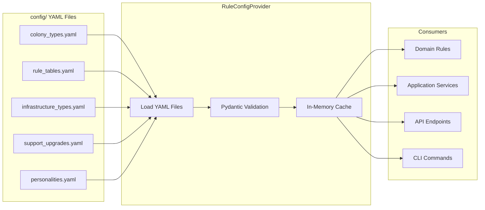
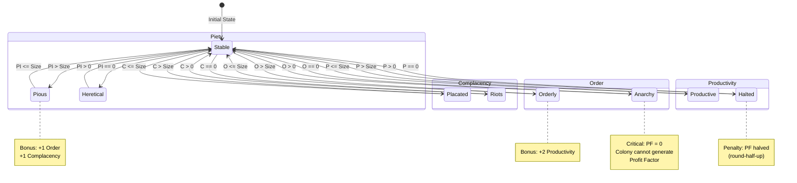
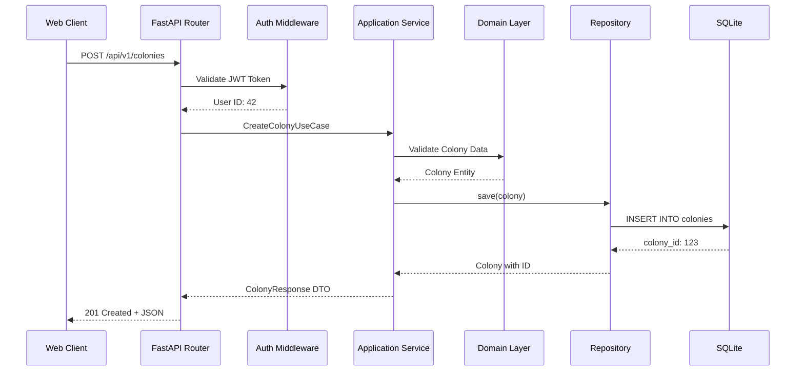

# Architecture — Phase 1 Foundation

**Created:** 2026-08-23
**Based on:** `technical_analysis.md` + `.clinerules/00-overview.md`
**Status:** Implemented

---

## System Overview

**WH40k Colony Manager** is a Python engine for Warhammer 40k Rogue Trader colony simulation, designed for consumption by multiple frontends (REST API, web UI, future desktop app).

### Key Design Principles

1. **Domain logic has zero I/O** — No FastAPI, SQLAlchemy, or file-system access in domain code
2. **Game rule data is data, not code** — Numeric tables in YAML config files, not if/elif chains
3. **Don't abstract preemptively** — Only introduce abstractions when used in ≥2 places with real duplication
4. **Dependencies point inward** — `adapters → application → domain`

---

## Layered Architecture

```text
src/colony_manager/
├── domain/              # Pure business logic, zero I/O
│   ├── models/          # Colony, Representative, Infrastructure, etc.
│   ├── rules/           # Calculation rules (stateless functions)
│   └── ports/           # Repository interfaces (Protocol/ABC)
│
├── application/         # Use cases / services
│   └── services/        # Orchestrates domain + ports
│
├── adapters/            # External world implementations
│   ├── persistence/     # SQLite repository implementations
│   ├── io/              # JSON/YAML import & export
│   ├── api/             # FastAPI routers, schemas
│   └── cli/             # Typer command-line entry points
│
└── config/              # Rule-table data (YAML)
    ├── colony_types.yaml
    ├── rule_tables.yaml
    └── personalities.yaml
```

### Dependency Inversion

Domain code defines interfaces it needs; adapters implement them:

```python
# domain/ports/colony_repository.py
class ColonyRepository(Protocol):
    def get(self, colony_id: int) -> Colony | None: ...
    def save(self, colony: Colony) -> Colony: ...
    def delete(self, colony_id: int) -> None: ...

# adapters/persistence/repositories/colony_repository_impl.py
class SQLAlchemyColonyRepository(ColonyRepository):
    # Implementation using SQLModel/SQLAlchemy
```

---

## Model Families (Pydantic Throughout)

Pydantic is used for three **separate** model families — do not collapse them:

### 1. Domain Models (`domain/models/`)

Business invariants, validation rules:

### State Transitions

Explicit enums computed from thresholds:

- `Order == 0` → Anarchy (PF = 0)
- `Complacency > Size` → Placated
- `Productivity == 0` → PF halved
- `Piety > Size` → Pious (+1 Order, +1 Complacency)

### Modifier Stacking

1. Infrastructure bonuses/penalties (per instance, working vs. disrupted)
2. Support upgrades (limited by base_size)
3. Representative personalities (1..N traits)
4. Planetary resources (colony-type-specific)
5. GM custom modifiers

**Order of operations:**

1. Sum all modifiers per stat
2. Clamp stats at 0
3. Calculate Profit Factor
4. Apply zero-forcing (Order == 0 → PF = 0)
5. Apply halving (Productivity == 0 → PF / 2, round-half-up)
6. Derive lore states

---

## Configuration System

All game rule data in YAML files under `config/`:

| File | Contents |
|------|----------|
| `colony_types.yaml` | 9 colony types with base stats, special rules |
| `rule_tables.yaml` | PF lookup, leadership modifiers, thresholds, infrastructure, upgrades, resources |
| `personalities.yaml` | 18 Representative personalities with effects |

**Benefits:**

- Houserules/balance changes don't require code changes
- Rule engine trivially testable against known table values
- No magic numbers in business logic

---

## Persistence & I/O

### Two Separate Capabilities

#### 1. Repository (source of truth at runtime)

- Interface: `ColonyRepository` in domain
- Implementation: SQLite via SQLModel/SQLAlchemy
- Operations: get, save, list, delete

#### 2. Importer/Exporter (portability)

- Location: `adapters/io/`
- Formats: JSON, YAML
- Purpose: Save files, backups, sharing
- **Not** a second Repository backend

### Migration Utility

Excel importer in `tools/` or `scripts/` (throwaway, not core feature):

- Reads existing Excel workbooks
- Produces JSON/YAML save file or seeds SQLite DB
- Brittle by design — not over-engineered

---

## API Design

### REST Principles

- Resource-oriented endpoints (`/colonies`, `/representatives`, `/infrastructure`)
- HTTP verbs for actions (GET, POST, PUT, PATCH, DELETE)
- JWT Bearer token authentication
- Versioned path (`/api/v1/`)

### Authentication Flow

1. Register user (public)
2. Login → access token (30 min) + refresh token
3. Include `Authorization: Bearer <token>` in requests
4. Refresh before expiry

### Permission Levels

| Role | Permissions |
|------|-------------|
| Owner | Full control, delete colony, manage users |
| GM | Edit colony state, create events, apply modifiers |
| Party Member | View + limited edits (toggle infrastructure) |
| Viewer | Read-only |

---

## Testing Strategy

### Tools

- `pytest` for all tests
- `hypothesis` for property-based testing (rule engine)

### Risk-Based Prioritization

**High Risk (heavy testing + hypothesis):**
---

## Architecture Diagrams

Visual representations of the system architecture, data flow, and entity relationships.

### 1. Layered Architecture

Dependencies flow inward from external interfaces through adapters and application services to the pure domain layer.

```mermaid
flowchart TD
    subgraph External["External World"]
        API[FastAPI Routes]
        CLI[Typer CLI]
        UI[Web/Desktop UI]
    end

    subgraph Adapters["adapters/"]
        API_Adapter[API Adapters]
        CLI_Adapter[CLI Adapters]
        Persistence[Persistence Layer]
        IO[Import/Export]
    end

    subgraph Application["application/"]
        Services[Application Services]
        UseCases[Use Cases]
    end

    subgraph Domain["domain/"]
        Models[Domain Models]
        Rules[Rule Engine]
        Ports[Repository Interfaces]
    end

    External --> Adapters
    Adapters --> Application
    Application --> Domain
    Persistence -.->|"implements"| Ports
```



---

### 2. Entity Relationships

Domain model relationships and key attributes.

```mermaid
erDiagram
    USER ||--o{ COLONY_USER : "owns/manages"
    COLONY ||--o{ COLONY_USER : "has members"
    COLONY ||--|| REPRESENTATIVE : "has one"
    COLONY ||--o{ INFRASTRUCTURE : "contains"
    COLONY ||--o{ SUPPORT_UPGRADE : "contains"
    COLONY ||--o{ RESOURCE : "exploits"
    COLONY ||--o{ DEVELOPMENT_PLAN : "has active"
    COLONY ||--o{ EVENT_LOG : "generates"
    COLONY ||--o{ MODIFIER : "has active"
    
    USER {
        int id PK
        string username
        string email
    }
    
    COLONY {
        int id PK
        string name
        ColonyType type
        int size
        int complacency
        int productivity
        int order
        int piety
    }
    
    REPRESENTATIVE {
        int id PK
        string name
        RepType type
        Personality personality
    }
    
    INFRASTRUCTURE {
        int id PK
        InfrastructureType type
        bool is_working
    }
    
---

### 3. Rule Engine Calculation Pipeline

How modifiers stack and flow through the calculation pipeline to produce final stats and Profit Factor.

```mermaid
flowchart TB
    subgraph Input["Input State"]
        BaseStats[Base Colony Stats]
        Infra[Infrastructure Modifiers]
        Upgrades[Support Upgrades]
        Rep[Representative Bonuses]
        Resources[Planetary Resources]
        GM[GM Custom Modifiers]
    end

    subgraph Process["Calculation Pipeline"]
        Sum[Sum All Modifiers]
        Clamp[Clamp Stats at 0]
        PF[Calculate Base PF]
        ZeroForce{Order == 0?}
        HalfForce{Productivity == 0?}
        States[Derive Lore States]
    end

    subgraph Output["Final State"]
        FinalStats[Final Stats]
        FinalPF[Final Profit Factor]
        LoreStates[Lore States]
    end

    BaseStats --> Sum
    Infra --> Sum
    Upgrades --> Sum
    Rep --> Sum
    Resources --> Sum
    GM --> Sum

    Sum --> Clamp
    Clamp --> PF
    PF --> ZeroForce
    ZeroForce -->|Yes| ZeroPF[PF = 0]
    ZeroForce -->|No| HalfForce
    HalfForce -->|Yes| HalfPF[PF = PF / 2]
    HalfForce -->|No| States
    States --> FinalStats
    States --> FinalPF
    States --> LoreStates
    ZeroPF --> FinalPF
    HalfPF --> FinalPF
```

---

### 4. Configuration Loading

How YAML configuration files are loaded, validated, and consumed throughout the application.



---

### 5. Lore State Transitions

State machine showing how colony stats transition between different lore states based on thresholds.



---

### Diagram Legend

| Symbol | Meaning |
|--------|---------|
| `→` | Direct dependency or flow |
| `-.->` | Interface implementation |
| `||--o{` | One-to-many relationship (ERD) |
| `||--||` | One-to-one relationship (ERD) |
| `-->` | State transition or message flow |
| `{}` | Decision point in flowchart |
| `[]` | Process or action box |

    SUPPORT_UPGRADE {
        int id PK
        UpgradeType type
        int quantity
    }

```

---

### 6. Request Lifecycle

Sequence diagram showing a typical API request flow from client to database and back.



- Stat derivation and stacking
- Threshold-based state transitions
- Profit Factor calculation with penalties

**Medium Risk (standard pytest):**

- Application services orchestration
- Repository round-trips
- Importer/exporter validation

**Lower Risk (light coverage):**

- API schema validation (Pydantic does most of this)
- CLI argument parsing

### Test Invariants (Hypothesis)

- Stats never go below 0 regardless of modifier stacking
- Order == 0 always forces PF = 0
- Adding working infrastructure never decreases the stat it increases

---

## Code Style

### Type Hints

Full type hints everywhere:

- Function signatures
- Class attributes
- Return types

### Docstrings

Google-style for all public modules/classes/functions.

### Tooling

- **ruff** — Linting and formatting
- **mypy** — Static type checking
- **pre-commit** — Run tools before commits

---

## What NOT to Do

❌ **Don't** let API models double as domain models
❌ **Don't** put business logic in route handlers or CLI commands
❌ **Don't** encode rule tables as if/elif chains in code
❌ **Don't** reach for plugin/strategy pattern before concrete second use case
❌ **Don't** mock domain layer in domain tests (it has no I/O)
❌ **Don't** test rule engine indirectly through API in unit tests

---

- Stats cannot go below 0
- Derived state (lore states) computed, not stored
- Example: `Colony`, `Representative`, `Infrastructure`

### 2. API Schemas (`adapters/api/schemas/`)

Request/response shapes, may diverge from domain:

- Pagination fields
- Partial-update payloads
- Display-only computed fields
- **Map explicitly** between domain and API models

### 3. Persistence Models (`adapters/persistence/orm_models.py`)

SQLModel/SQLAlchemy models for database:

- Foreign keys, relationships
- Explicit mapping to/from domain models
- Schema evolution considerations

---

## Rule Engine Design

### Characteristics

- **Pure functions** or stateless classes
- Signature: `(colony_state, rule_tables) → derived_state`
- No I/O, no mutation of arguments, no hidden globals
